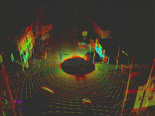

# Ouster-LiDAR-Pcap-to-ROS2
Convert ouster pcap data to ros2 topic

Author : sweunwave



## quick start 
1. install this repository<br/>
```
git clone https://github.com/sweunwave/Ouster-LiDAR-Pcap-to-ROS2.git
```

2. follow ouster-sdk install [document](https://static.ouster.dev/sdk-docs/cpp/building.html)<br/>

3. colcon build
```
colcon build --symlink-install --cmake-args -DCMAKE_BUILD_TYPE=Release --packages-select lidar_dev
```
4. set to pcap path, line 62~63 in os_pcap_to_ros.cpp   

5. run
```
ros2 run lidar_dev os_pcap_to_ros
```


## To-Do-List
- [ ] Source Optimization
